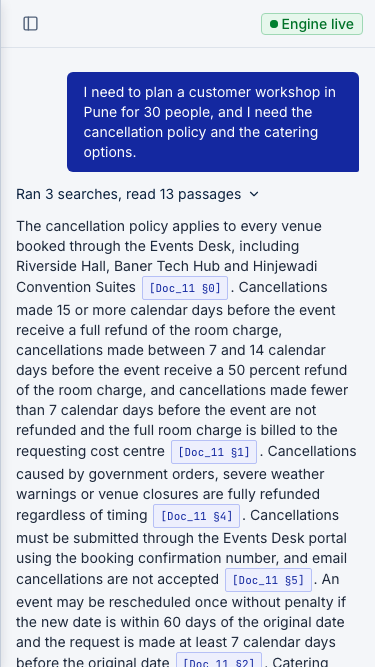
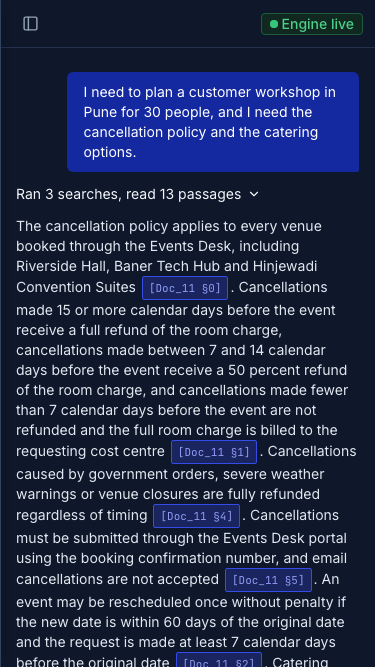
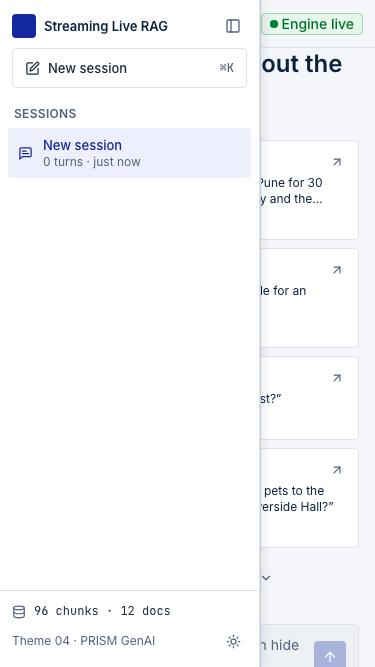
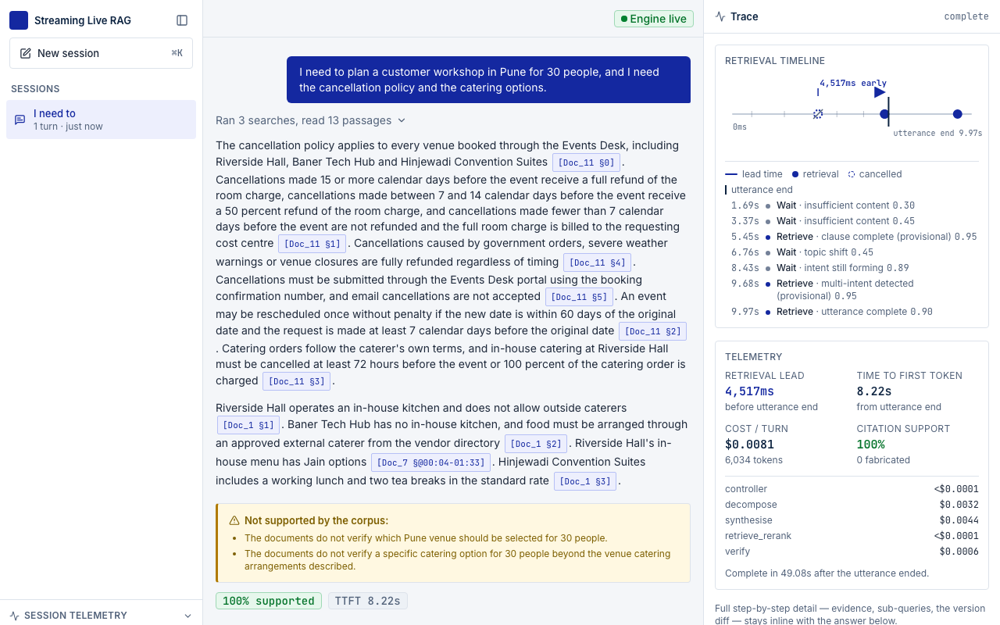
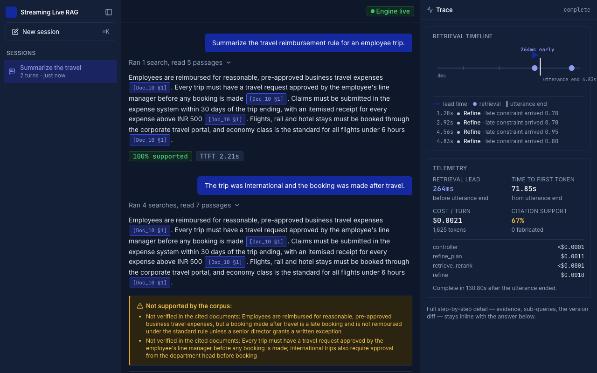

# Baseline report: the legacy console, measured

This is a dated measurement of the running console **before** the responsive-hardening phase. It is regenerated with `npm run build && npm run test:e2e && npm run baseline:report`; it is not a specification.

|  |  |
|---|---|
| Generated | 2026-09-25 |
| Commit | 58c8542 plus uncommitted changes |
| Matrix | 16 projects (8 viewports, each light and dark) × 9 states; e2e mode: baseline (defects recorded, not failed) |
| Tooling | Node 20.18.0 · Playwright 1.63.0 · Chromium 153.0.8010.12 · axe-core 4.13.0 |
| App under test | static export `out/` served by the mock engine (`e2e/mock-engine`), replaying real trace records |

## Summary

| Check | Result | Meaning |
|---|---|---|
| Horizontal overflow (R4) | **0** defects | 134 page states checked; no page, scroll region or element widened past the viewport |
| Accessibility, serious or critical (R5) | **30** defects in 6 of 16 projects | 1 distinct axe rule(s) failed; see below |
| Colour contrast (axe) | **0** violations | axe reads the computed colours, so this tests the tokens as they render, in both themes |
| Token burn-down (`check-tokens --strict`) | **224** findings | what P12 has to remove before strict mode can pass |
| First-load bundle | **342.8 KB** gzip | 334.4 KB JS + 8.3 KB CSS |

## Horizontal overflow

| Project | States checked | Defects |
|---|---|---|
| 375-light | 9 | 0 |
| 375-dark | 9 | 0 |
| 390-light | 9 | 0 |
| 390-dark | 9 | 0 |
| 430-light | 9 | 0 |
| 430-dark | 9 | 0 |
| 768-light | 8 | 0 |
| 768-dark | 8 | 0 |
| 1024-light | 8 | 0 |
| 1024-dark | 8 | 0 |
| 1280-light | 8 | 0 |
| 1280-dark | 8 | 0 |
| 1440-light | 8 | 0 |
| 1440-dark | 8 | 0 |
| 1920-light | 8 | 0 |
| 1920-dark | 8 | 0 |

No offenders in any state. Read this with its limits: the fixtures hold no tables, code blocks or very long identifiers, which is where the static audit (LR-05) expected trouble. That worst case is covered separately by `e2e/prose.spec.ts`, which injects it into the real answer stylesheet and always enforces; and the responsive-hardening phase adds long-content stress states (P10-F06).

## Accessibility (axe-core, WCAG 2.2 A and AA)

| Project | States checked | Serious or critical |
|---|---|---|
| 375-light | 9 | 0 |
| 375-dark | 9 | 0 |
| 390-light | 9 | 0 |
| 390-dark | 9 | 0 |
| 430-light | 9 | 0 |
| 430-dark | 9 | 0 |
| 768-light | 8 | 0 |
| 768-dark | 8 | 0 |
| 1024-light | 8 | 0 |
| 1024-dark | 8 | 0 |
| 1280-light | 8 | 5 |
| 1280-dark | 8 | 5 |
| 1440-light | 8 | 5 |
| 1440-dark | 8 | 5 |
| 1920-light | 8 | 5 |
| 1920-dark | 8 | 5 |

| Impact | Rule | What it means | Nodes | Projects | States | Example |
|---|---|---|---|---|---|---|
| serious | `nested-interactive` | Interactive controls must not be nested | 30 | 6 | turn-compound-trace, turn-compound, turn-late-detail, turn-suppressed, … | `.overflow-visible` |

## Token burn-down

`node scripts/check-tokens.mjs --strict` ignores the baseline and counts every finding in the legacy code. The default gate passes because none of these may grow (`scripts/check-tokens.baseline.json`).

| Rule | What | Findings |
|---|---|---|
| V1 | colour literals | 0 |
| V2 | default palette / arbitrary colours | 0 |
| V3 | primitives used outside tokens.css | 0 |
| V4 | arbitrary lengths | 13 |
| V5 | gradients | 0 |
| V6 | animations other than spin and sheet-in | 20 |
| V7 | rounded-full outside status dot and spinner | 6 |
| V8 | arbitrary font sizes | 10 |
| V9 | legacy aliases | 175 |

## First-load bundle

| Asset | Raw | Gzip |
|---|---|---|
| `chunks/2w33or3544-92.css` | 36.3 KB | 8.3 KB |
| `chunks/3thp5hmq33yks.js` | 20.2 KB | 6.8 KB |
| `chunks/2-zi-rk1ubomi.js` | 174.5 KB | 46.4 KB |
| `chunks/0dr-zs30cmz0j.js` | 223.8 KB | 70.0 KB |
| `chunks/turbopack-1aagomvwjb60m.js` | 9.5 KB | 3.7 KB |
| `chunks/1p6kwmlvkoihj.js` | 15.7 KB | 4.2 KB |
| `chunks/0_lkw9strh8y5.js` | 638.8 KB | 164.7 KB |
| `chunks/0cz1d0mv5g_q7.js` | 110.0 KB | 38.7 KB |
| **Total** | **1228.6 KB** | **342.8 KB** |

The budget for P12-F12 is this total plus 10 percent (`docs/baseline/bundle.json`).

## Screenshots

**Phone, light: a compound answer**

**Phone, dark: the same answer**

**Phone: the sessions drawer opens over the page with no backdrop (LR-03)**

**Desktop, light: three columns and the trace pane**

**Desktop, dark: a late detail refines the answer**

## What this baseline does not cover

- Only the states in `e2e/helpers/app.ts` are measured: the empty greeting, the replay bar, the test-case browser, four replayed scenarios (one with the trace timeline expanded) and, on phones, the sessions drawer.
- The mock engine replays real trace records through a port of the engine's own AG-UI translator. Timing, evidence text and per-token pacing are reconstructed (see `e2e/fixtures/README.md`), so nothing here measures engine latency.
- Keyboard journeys, screen-reader behaviour, forced-colours and reflow at 320 px are covered from P10 and P11.

